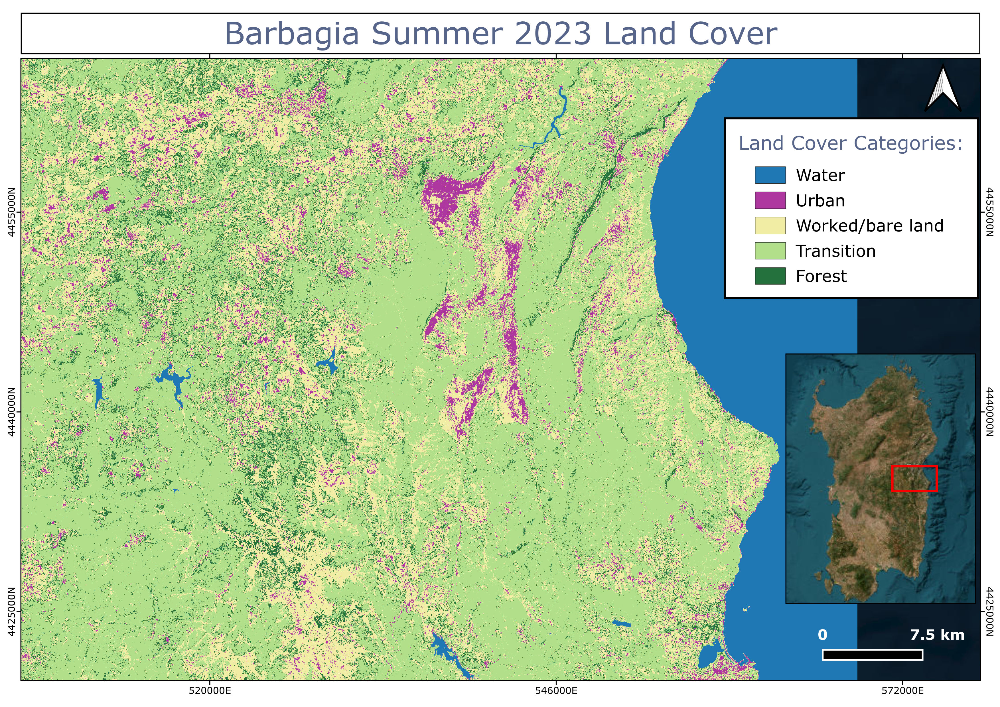

# Sentinel-2 Remote Sensing Portfolio

## 🔥 Project 1: Wildfire Burn Severity Mapping (Asciano Pisano, 2026)
**Location:** Asciano Pisano, Tuscany, Italy
**Objective:** Assessment of wildfire impact and burn severity classification using multi-temporal Sentinel-2 imagery.

### 🛰️ Data & Processing
*   **Sensor:** Sentinel-2 L2A (Copernicus/ESA).
*   **Temporal Range:** 
    *   Pre-fire: 2026-04-27
    *   Post-fire: 2026-05-02
*   **Methodology:** Calculation of the **Normalized Burn Ratio (NBR)** for both dates and subsequent derivation of **dNBR** (delta NBR).
*   **Classification:** Burn severity levels mapped using standard **USGS thresholds**.

### 🛠️ Software Stack
*   **Google Earth Engine (GEE):** Used for large-scale data retrieval and spectral index calculation.
*   **QGIS 4.0:** Used for spatial analysis, statistical calculation of affected hectares, and final cartographic production.

### 📊 Key Findings
Total mapped area: **259.3 ha**
*   **High Severity:** 97.8 ha
*   **Moderate-High:** 68.6 ha
*   **Moderate-Low:** 92.9 ha

### Visual Result

### 💻 The Logic (GEE Script)
The analysis was performed using **JavaScript in Google Earth Engine**. The script automates:
*   Multi-temporal mosaic creation from Sentinel-2 L2A collections.
*   Automated NBR calculation and dNBR subtraction.
*   Thresholding based on USGS burn severity levels.

---

## 🛰️ Project 2: Supervised Land Cover Classification (Barbagia, 2023)
**Location:** Barbagia Region, Sardinia, Italy
**Objective:** Automated mapping of 5 land cover classes using Machine Learning to assess landscape distribution.

### 🧠 Machine Learning Workflow
*   **Algorithm:** Random Forest (50 trees).
*   **Input Features:** Sentinel-2 Spectral Bands (B2, B3, B4, B8, B11, B12) + **NDVI** as an additional specialized band.
*   **Data Partitioning:** 70% of points for training / 30% for validation (independent test set).
*   **Accuracy Assessment:** Calculation of an **Overall Accuracy** and Confusion Matrix to validate the classifier's performance.

### 📊 Classification Categories
0. **Water** 🟦
1. **Urban/Anthropogenic** 🟪
2. **Worked/Bare Land** 🟨
3. **Forest** 🟩
4. **Transition Vegetation** 🟩 (Light)

### Visual Result

*The processing script utilizing Google Earth Engine's `smileRandomForest` is available in the `/scripts` folder.*
*You can find the full processing script in the `/scripts` folder of this repository.*

---
**N. Poddighe | University of Cagliari**
